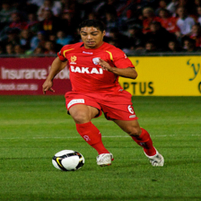

# VLM from Scratch

This repository is a compact image captioning project built to show how a Vision-Language Model can be assembled from simple parts: a pre-trained vision encoder, a trainable projector, and a causal language model. The target task is caption generation on Flickr8k.

In this project, "from scratch" refers to the multimodal wiring, training loop, and inference pipeline. The vision backbone and language model are loaded from pre-trained checkpoints.

## Qualitative results

The examples below are taken from [results/captions.txt](results/captions.txt) and [results/images](results/images). Ground-truth captions come from Flickr8k, while model captions are copied from the latest evaluation outputs and lightly cleaned up for readability.

<table>
  <tr>
    <td align="center">
      
    </td>
    <td align="center">
      
    </td>
    <td align="center">
      
    </td>
  </tr>
  <tr>
    <td align="left">
      <strong>Ground truth:</strong><br>
      A man in a red soccer uniform getting ready to kick the ball.<br><br>
      <strong>Model caption:</strong><br>
      This image shows a soccer player in red and white, kicking a soccer ball.
    </td>
    <td align="left">
      <strong>Ground truth:</strong><br>
      A little girl playing the guitar, some flowers to the left.<br><br>
      <strong>Model caption:</strong><br>
      This image shows a girl in a blue shirt and blue jeans playing the guitar.
    </td>
    <td align="left">
      <strong>Ground truth:</strong><br>
      A bird lands in the water.<br><br>
      <strong>Model caption:</strong><br>
      This image shows a bird flying over water.
    </td>
  </tr>
</table>

These examples show the current behavior of the model quite well: captions are now shorter and cleaner, and the model usually gets the main scene right even when some fine-grained details are still missing.

## Single-image inference example

The repository also includes an example image taken from the internet: [image.png](image.png).

<p align="center">
  
</p>
<p align="center">
  <strong>Caption:</strong> This image shows a crowd of people in a busy city .
</p>


## Project goal

The goal is to map an input image to a natural language description.

At a high level, the model:

- encodes the image into a sequence of visual tokens;
- projects those visual tokens into the embedding space of the language model;
- concatenates image tokens and text tokens;
- trains the language model to predict the caption autoregressively.

This makes the repository useful as a clear, minimal reference for understanding how image captioning works in a custom PyTorch VLM pipeline.

## How the model works

The architecture is made of four main pieces.

### 1. Vision encoder

The visual backbone is a pre-trained Vision Transformer:

- model: `google/vit-large-patch16-224`
- role: turn the input image into patch-level visual features
- output: the ViT `last_hidden_state`

From an architectural point of view, a Vision Transformer does not process the image with convolutions. Instead, it splits the image into fixed-size patches, converts each patch into a token embedding, and then runs a Transformer encoder over the full sequence of patch tokens. Self-attention allows every patch to interact with every other patch, so the encoder can model both local details and global scene structure.

This is exactly why it is useful in this project: the model does not need a single image classification vector, but a sequence of contextualized visual tokens that can later be aligned with text tokens. The ViT provides a dense token-level representation of the image, and that sequence can be passed through the projector to become conditioning input for the language model.

In practice, the vision encoder is the part that answers the question: "what visual content is present in the image, and how is it distributed across patches?" The encoder is frozen inside the VLM, so training focuses on learning how to connect these visual features to the text side.

Relevant files:
- [src/load_models.py](src/load_models.py)
- [src/vlm.py](src/vlm.py)

### 2. Projector

The projector is the bridge between vision and language. Its job is to transform the ViT features into vectors that live in the same embedding space as the language model.

The implementation is in [src/projector.py](src/projector.py). It contains:

- an input projection: `Linear -> GELU -> LayerNorm`
- a stack of residual gated MLP blocks
- an output projection: `LayerNorm -> Linear`

With the current configuration in [config.yaml](config.yaml), the projector uses:

- `hidden_multiplier: 4`
- `num_layers: 3`
- `dropout: 0.2`
- `use_gated_blocks: true`

### 3. Language model

The text module is a causal language model:

- model: `HuggingFaceTB/SmolLM-360M`
- role: consume image-conditioned embeddings and generate the caption token by token

From an architectural point of view, this module is a Transformer decoder trained with a next-token prediction objective. It processes a token sequence left-to-right using causal self-attention, meaning that each position can attend only to previous positions. This makes it suitable for autoregressive text generation: given the tokens seen so far, it predicts the next one.

In this repository, the language model receives a multimodal prefix. The projected visual tokens are concatenated before the caption tokens, so the decoder treats the image representation as context for generation. Architecturally, this means the language model is not just a text component added at the end: it is the module that turns the visual representation into fluent language by conditioning every next-token prediction on both the image tokens and the previously generated words.

This module is therefore essential for two reasons. First, it provides the linguistic prior needed to generate grammatical and coherent captions. Second, it acts as the actual decoder of the whole VLM: once the projector has aligned the image features to the text embedding space, the language model is the component that converts that aligned representation into a natural-language description.

Relevant file:
- [src/vlm.py](src/vlm.py)

### 4. Loss

The training objective is standard autoregressive cross-entropy on the caption tokens.

The forward pass works as follows:

1. the image is encoded by the ViT;
2. the projector maps visual tokens into the language model embedding space;
3. image embeddings are concatenated with text embeddings;
4. a joint attention mask is built for image and text tokens;
5. the image-token labels are filled with `-100` so they are ignored by the loss;
6. the language model computes the loss only on the caption tokens.

This means the visual tokens condition generation, but only the caption tokens contribute to the training loss.

Relevant file:
- [src/vlm.py](src/vlm.py)

## Training setup

The project uses the `jxie/flickr8k` dataset through Hugging Face Datasets.

Key details:

- each image has 5 reference captions;
- the training split samples a random caption per image to add variability;
- validation and test use deterministic captions;
- optimization uses `AdamW`, gradient clipping, checkpointing, and a `StepLR` scheduler;
- early stopping and Comet logging are supported.

Relevant files:
- [src/dataset.py](src/dataset.py)
- [src/train.py](src/train.py)
- [config.yaml](config.yaml)

## Running the project

### Environment setup

```bash
python -m venv .venv
source .venv/bin/activate
pip install -r requirements.txt
```

### Train

```bash
python main.py --train
```

With Comet logging:

```bash
python main.py --train --comet
```

### Evaluate on the test split

```bash
python main.py --test --checkpoint checkpoints/vlm_best.pt
```

This writes qualitative outputs to:

- `results/images/`
- `results/captions.txt`

### Run inference on a single image

```bash
python main.py single_test --image image.png --checkpoint checkpoints/vlm_best.pt
```

`single_test.py` accepts images of arbitrary size and adapts them to the input resolution expected by the ViT through resize plus center crop.

